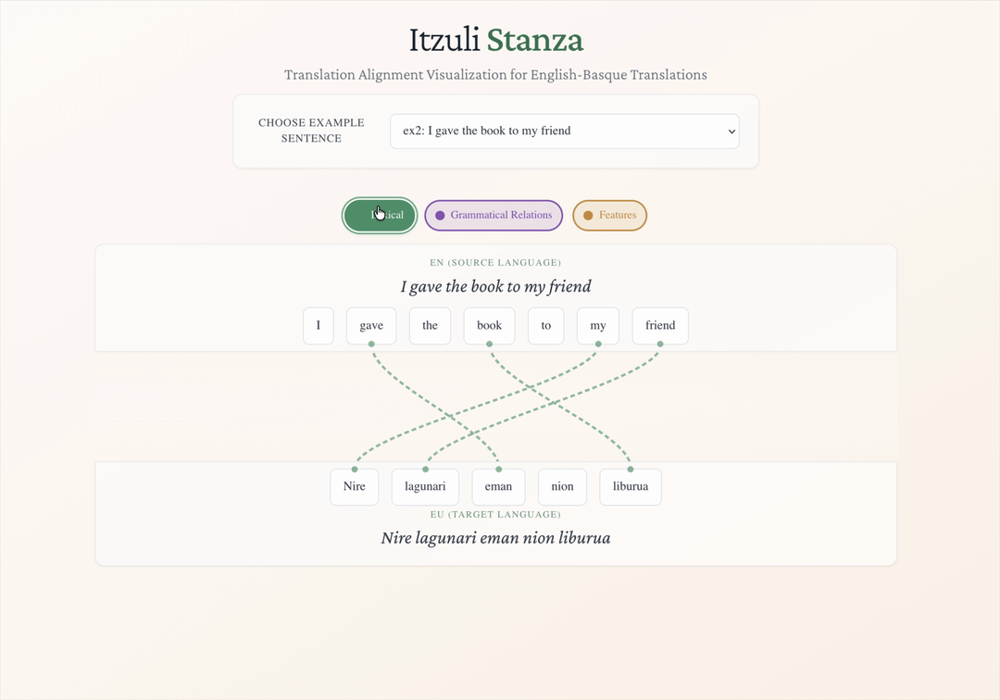

# Xingolak

## Translation Alignment Visualization for Basque

[🇺🇸 English](README.md) | [🔴⚪🟢 Euskera](README.eu.md)



**Xingolak** (Basque for "ribbons") is an interactive web application that visualizes how words and grammatical structures align between English and Basque translations. By connecting translation with deep linguistic analysis, Xingolak reveals the fascinating differences between how English and Basque express meaning.

## What Xingolak Does

Xingolak takes any English text, translates it to Basque, and shows you exactly how the two languages correspond at multiple linguistic levels. Rather than just showing a side-by-side translation, it draws animated "ribbons" that connect related words and concepts, helping you understand:

- **Which English words correspond to which Basque words**
- **How grammatical roles transfer between languages**
- **Where English grammar gets redistributed across Basque words**

The app reveals the deep structural differences between English (which relies heavily on word order) and Basque (which uses rich morphological markers and flexible word order).

## Understanding the Three Analysis Layers

Xingolak analyzes translation alignments at three distinct linguistic levels:

### 🟢 **Lexical**

Shows dictionary-level correspondences between English words and their direct Basque equivalents. This layer reveals:

- Basic word-to-word translations
- Cases where English concepts map directly to Basque words
- Vocabulary relationships across languages

### 🟣 **Grammatical Relations**

Demonstrates how each language marks sentence roles and relationships. This layer shows:

- How English uses word order to show relationships (Subject-Verb-Object)
- How Basque uses case suffixes and verb agreement instead
- The different ways languages indicate "who is doing what to whom"

### 🟠 **Features**

Reveals how grammatical information gets distributed across words. This layer exposes:

- How English tense markers spread across multiple Basque words
- Where definiteness, negation, and agreement live in each language
- The "hidden" grammatical information embedded in word forms

## How It Works

Xingolak uses a sophisticated AI-powered pipeline to generate these visualizations:

```code
English Text → Itzuli API → Stanza NLP → Claude AI → Interactive Visualization
     ↓             ↓            ↓           ↓              ↓
  "Input text"  Translation  Linguistic   Alignment    Animated ribbons
                            Analysis     Generation      & interactions
```

1. **Translation**: Your English text is translated to Basque using the [Itzuli API](https://itzuli.eus)
2. **Linguistic Analysis**: Both texts are analyzed using [Stanford's Stanza NLP](https://stanfordnlp.github.io/stanza/) to identify grammatical structures
3. **Alignment Generation**: Claude AI analyzes both linguistic structures to generate precise alignments
4. **Visualization**: The web interface renders interactive ribbons showing these connections

## Key Features

### 🎯 **Interactive Word Exploration**

- **Hover** over any word to see its connections light up
- **Click** to pin a word and explore its alignments in detail
- **Switch layers** to see different types of linguistic relationships

### 🌍 **Multilingual Interface**

The entire interface supports four languages:

- **English** - Full functionality
- **Euskera (Basque)** - Native language interface
- **Español (Spanish)** - Complete Spanish localization
- **Français (French)** - Full French translation

### 📱 **Responsive Design**

- Works seamlessly on desktop and mobile devices
- Adaptive layout that handles complex sentence structures
- Smooth animations that reveal linguistic relationships

### ♿ **Accessibility Features**

- Full screen reader support with detailed aria labels
- Keyboard navigation for all interactive elements
- High contrast visualization options

## Getting Started

### Required API Keys

To run Xingolak, you'll need access to two APIs:

#### 1. **Itzuli API Key**

The Itzuli API provides high-quality English ↔ Basque translation.

- **Get your key**: Visit [itzuli.vicomtech.org/en/api/](https://itzuli.vicomtech.org/en/api/) and fill out the form to request API access
- **Usage**: Translation between English and Basque
- **Cost**: Pricing details are not publicly available - contact them through the API request form for information

#### 2. **Claude API Key**

Claude AI generates the sophisticated linguistic alignments that power the visualizations.

- **Get your key**: Sign up at [console.anthropic.com](https://console.anthropic.com)
- **Usage**: Linguistic analysis and alignment generation
- **Cost**: Check current pricing at [anthropic.com](https://www.anthropic.com/pricing)

### Installation & Setup

1. **Clone the repository**:

```bash
git clone https://github.com/your-repo/itzuli-stanza-mcp
cd itzuli-stanza-mcp
```

1. **Set up the backend**:

```bash
cd backend
# Follow backend/README.md for detailed setup instructions
```

1. **Set up the frontend**:

```bash
cd frontend
npm install
npm run dev
```

1. **Configure your API keys** following the setup guides in the backend documentation.

## Project Structure

```code
itzuli-stanza-mcp/
├── frontend/          # Xingolak web application (TypeScript + React)
└── backend/           # NLP processing pipeline (Python)
    ├── core/          # Core translation and analysis workflows
    ├── alignment_server/  # HTTP API for frontend integration
    └── mcp_server/    # Claude MCP server integration
```

## Documentation

- **[Backend Setup](backend/README.md)** - Complete Python backend setup guide
- **[System Architecture](backend/ARCHITECTURE.md)** - Detailed technical architecture
- **[Backend Setup (Euskera)](backend/README.eu.md)** - Setup guide in Basque
- **[Architecture (Euskera)](backend/ARCHITECTURE.eu.md)** - Architecture documentation in Basque

## About the Name

**Xingolak** (pronounced "sheen-go-lock") means "ribbons" in Basque, reflecting the visual metaphor of ribbons connecting related concepts across languages. The name captures both the visual design of the interface and the conceptual idea of linguistic connections that bind meaning across different language systems.
